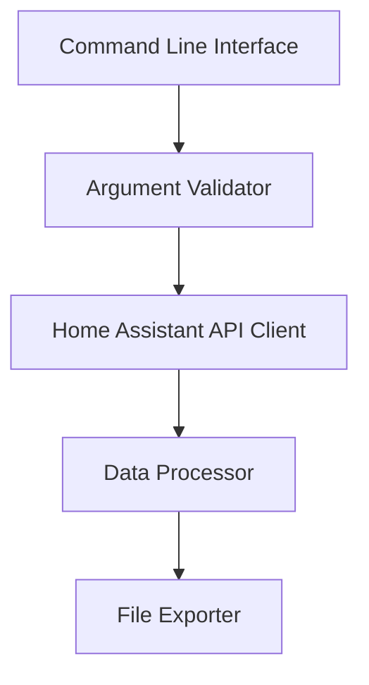

# System Patterns: Home Assistant Sensor Data Export

## Architecture Overview

The Home Assistant Sensor Data Export tool follows a simple, modular architecture designed for clarity and maintainability:

## Key Components

### 1. Command Line Interface
- Handles argument parsing using Python's `argparse` library
- Provides clear usage instructions and error messages
- Entry point for the application

### 2. Argument Validator
- Validates user inputs (sensor entity ID, time range, output file)
- Ensures time range is positive
- Creates output directories if they don't exist

### 3. Home Assistant API Client
- Encapsulated in the `HomeAssistantAPI` class
- Handles authentication with Home Assistant
- Manages API requests and error handling
- Retrieves historical sensor data

### 4. Data Processor
- Converts API responses to a structured format
- Handles timestamp parsing and normalization
- Converts numeric values when appropriate

### 5. File Exporter
- Determines output format based on file extension
- Formats data appropriately for each output type
- Handles file writing operations

## Design Patterns

### 1. Separation of Concerns
The code separates different responsibilities into distinct components:
- API communication
- Data processing
- File output
- Command-line interface

### 2. Configuration Management
- Sensitive configuration is separated from code
- Uses a template file to guide user setup
- Follows security best practices for credential management

### 3. Error Handling
- Comprehensive try/except blocks
- Graceful degradation with informative error messages
- Early validation to prevent runtime errors

### 4. Type Hinting
- Uses Python type hints throughout the codebase
- Improves code readability and IDE support
- Helps prevent type-related errors

## Data Flow

1. User provides command-line arguments
2. Arguments are validated and processed
3. Connection to Home Assistant is established and verified
4. Historical data is requested for the specified sensor and time range
5. Data is processed and converted to the appropriate format
6. Formatted data is written to the specified output file

## Technical Decisions

### 1. REST API vs WebSocket API
- Chose REST API for simplicity and compatibility
- WebSocket API would be more efficient for real-time data but adds complexity

### 2. Pandas for Data Processing
- Used pandas for data manipulation and export
- Provides built-in support for various file formats
- Simplifies data transformation operations

### 3. Virtual Environment
- Isolates dependencies from system Python
- Makes the project more portable and reproducible
- Simplifies dependency management

### 4. File Format Detection
- Automatically detects output format based on file extension
- Provides sensible defaults for unknown extensions
- Allows for future expansion to additional formats
